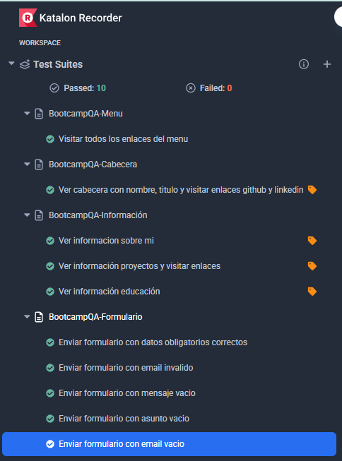

# Portfolio QA – Yohana Triana Aranzola  
**Portafolio web personal de proyectos de QA**  
🔗 [Ver Web Portfolio QA](https://yohana2026.github.io/Portfolio-QA---Yohana-Triana/)

---

## 🛠 Tecnologías utilizadas

---

## ⚙️ Funcionalidades principales
- Menú de navegación responsive
- Header con nombre, título profesional y enlaces a redes
- Sección de proyectos QA con descripción detallada
- Sección de formación académica
- Formulario de contacto

---

## QA Tests
Este portfolio incluye pruebas de regresión automatizadas con **Katalon Studio (Selenium)** de todas las funcionalidades principales. 

Para ejecutar los tests:
1. Descarga la carpeta tests
2. Abre el navegador chrome, busca e instala la extensión Katalon Recorder (Selenium Tests) [🔗 Extensiones Chrome](https://chromewebstore.google.com/ )
3. Abre la extensión Katalon Recorder y elige la opción Open test suite. Abre la carpeta tests que has descargado.
4. Ejecuta los test haciendo clic en Play all suites.

---

## 👩‍💻 Autor
**Yohana Triana Aranzola – QA Junior**  
[🔗 LinkedIn](https://www.linkedin.com/in/yohanatriana)

